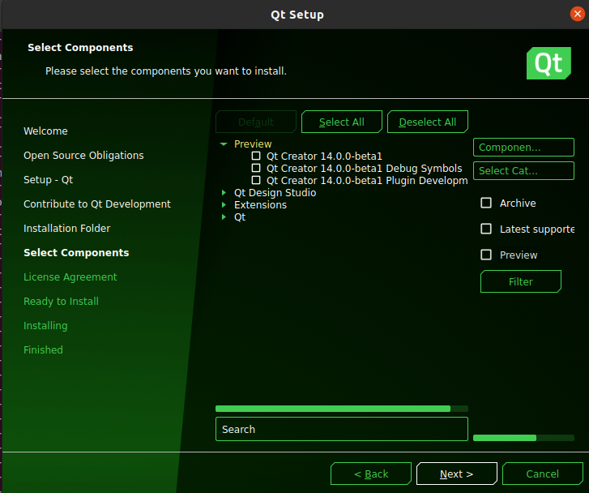
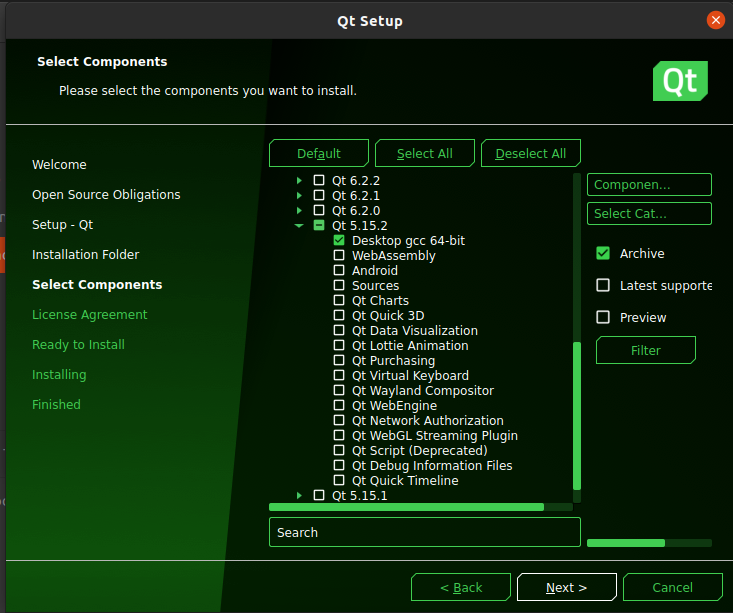

# Readme

## 安装QT

安装Linux版本的QT。下载[在线安装器](https://mirrors.tuna.tsinghua.edu.cn/qt/official_releases/online_installers/)，然后在命令行中指定源。

```
installer --mirror https://mirrors.tuna.tsinghua.edu.cn/qt
```

安装5.12.2版本的QT，选中`archive`然后点击`filter`。



然后选中`Desktop gcc 64-bit`，等待安装即可



## 下载和编译

```
mkdir -p ~/ur5_ws/src
cd ~/ur5_ws/src
git clone git@github.com:BrightSoulXYHY/bs_arm_control.git
cd ~/ur5_ws
catkin_make
rosrun bs_arm_control bs_arm_control
```

